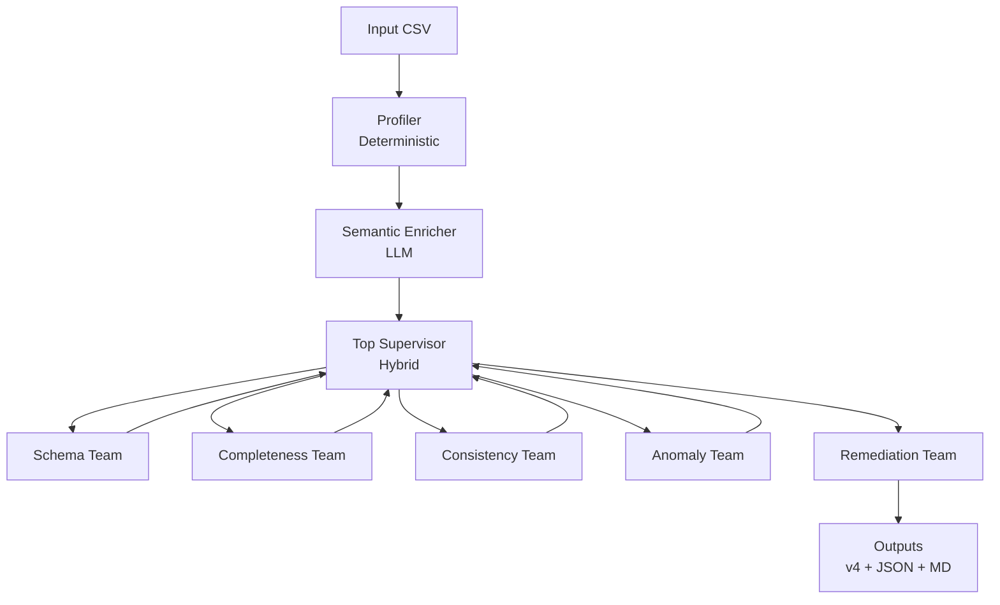
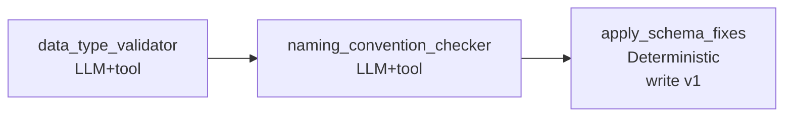
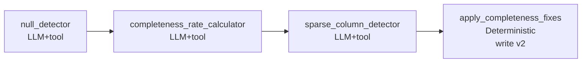
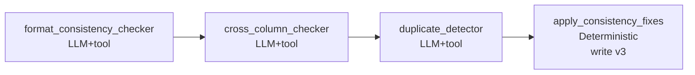
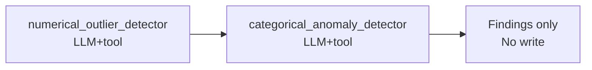
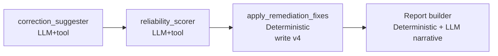
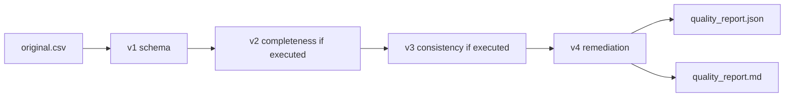

# Data Quality Flow Visual Guide

This guide explains the pipeline visually, with focus on:
- control flow
- where LLM is used
- where deterministic logic is enforced
- how artifacts evolve (`v1`..`v4`)

## Legend
- LLM node: model reasoning/generation
- Deterministic node: Python/pandas/rules-only
- Hybrid node: deterministic constraints + LLM decision support

## 1) End-to-End Flow


## 2) Hybrid Supervisor Decision Logic
```mermaid
flowchart TD
    S[Supervisor cycle] --> R1{Iteration trigger?}
    R1 -- Yes --> RI[Deterministic iteration route]
    R1 -- No --> R2[Compute eligible teams\nDeterministic]

    R2 --> R3{Eligible = FINISH?}
    R3 -- Yes --> END[Finish]
    R3 -- No --> R4{Borderline/ambiguous case?}

    R4 -- No --> RD[Deterministic top choice]
    R4 -- Yes --> RL[Ask LLM for route\n(next/reason/confidence)]

    RL --> RC{Valid + confidence >= threshold?}
    RC -- Yes --> RL2[Use LLM choice]
    RC -- No --> RD

    RI --> LOG[Append supervisor_decisions log]
    RD --> LOG
    RL2 --> LOG
    LOG --> NX[Go to selected team]
```

Guardrails always apply:
- schema first
- remediation last
- max 2 iterations
- LLM can only select from eligible teams

## 3) Team Internals

### Schema


### Completeness


### Consistency


### Anomaly


### Remediation


## 4) LLM vs Deterministic Map

| Component | Type | Why |
|---|---|---|
| Profiler (`create_dataset_profile`) | Deterministic | Fast, stable profiling |
| Semantic Enricher | LLM | semantic hints from names/samples |
| Top Supervisor | Hybrid | adaptive routing with strict guardrails |
| Team workers | LLM | richer diagnostics and explanations |
| `apply_*_fixes` | Deterministic | reproducible data transformations |
| Supervisor narrative (report) | LLM | concise presentation-ready explanation |
| Report serialization | Deterministic | stable artifact generation |

## 5) Artifact Evolution


## 6) Reporting Additions (Supervisor Explainability)
Reports now include:
- `supervisor_decisions`: per-step selected team, source (`deterministic`/`llm`), confidence, reason
- `supervisor_narrative`: short LLM-generated paragraph for slide-ready storytelling

This makes orchestration explainable to both technical and non-technical reviewers.
